# 家电医生 · Appliance Doctor

一个面向家庭用户的**冰箱故障诊断 Web 应用**：文字或照片描述故障 → 多 Agent 多轮诊断 → 三级安全护栏 → 详细维修建议。

技术亮点：LangGraph 多 Agent 状态机 + RAG 检索 + MCP 工具集 + 可量化的安全评估体系 + 前后端全栈 + PostgreSQL 持久化。

## 核心能力

- **多 Agent 多轮诊断**：诊断 Agent 与安全审查 Agent 分工；诊断 Agent 信息不足时通过 LangGraph `interrupt` 反问用户，收敛假设后再出结论。
- **三级安全护栏**：绿（可安全自修）/ 黄（谨慎操作·需断电）/ 红（必须找师傅）。安全审查 Agent 独立复核，红色场景绝不输出危险步骤。
- **可评估**：内置 15 用例评估集 + harness 脚本，量化安全等级准确率、危险漏报率（红线指标，当前为 0）、诊断可用率。
- **RAG + 图片识别**：Milvus 向量库 + BGE 本地 embedding 检索维修手册；DeepSeek 视觉模型识别铭牌与故障照片。
- **MCP 工具集**：查故障码 / 读铭牌 / 识别现象 / 查安全手册，以标准 MCP server 形式暴露。

## 技术架构

```mermaid
flowchart TB
    subgraph 前端
        UI[React + Vite + Tailwind<br/>四区域界面：家电名单/提问诊断/维修历史/安全手册]
    end

    subgraph 后端 FastAPI
        API[API 层]
        subgraph LangGraph[LangGraph 多 Agent 诊断图]
            DIAG[诊断 Agent] -->|信息不足| ASK[反问节点 interrupt]
            ASK --> DIAG
            DIAG -->|信息足够| SAFE[安全审查 Agent]
        end
        MCP[MCP Server<br/>查故障码/读铭牌/识别现象/查安全手册]
    end

    subgraph 模型与数据
        LLM[DeepSeek<br/>文本 + 视觉]
        VDB[(Milvus<br/>RAG 向量库)]
        EMB[BGE 本地 embedding]
        PG[(PostgreSQL<br/>家电名单 + 维修历史)]
        FC[(故障码表 JSON)]
    end

    UI -->|/api| API
    API --> LangGraph
    DIAG -->|LLM 推理| LLM
    DIAG -->|RAG 检索| VDB
    VDB --> EMB
    DIAG -->|确定性查表| FC
    SAFE -->|LLM 复核| LLM
    API --> MCP
    API --> PG
```



## 技术栈

| 层 | 技术 |
|----|------|
| 前端 | React 18、Vite 5、Tailwind CSS 3 |
| 后端 | Python 3.12、FastAPI |
| Agent 编排 | LangGraph（interrupt / resume 多轮状态机） |
| LLM | DeepSeek（文本 `deepseek-chat` + 视觉 `deepseek-v4-flash-vision-exp`） |
| RAG | Milvus Lite、BGE（bge-small-zh-v1.5）本地 embedding |
| 工具协议 | MCP（FastMCP） |
| 业务数据库 | PostgreSQL + SQLAlchemy |
| 部署 | Docker Compose（可选） |

## 目录结构

```
appliance-doctor/
├── frontend/app/        # React 前端
│   └── src/components/  # Header / ApplianceList / HistoryList / SafetyManual / Chat
├── backend/
│   ├── app/
│   │   ├── main.py      # FastAPI 入口（诊断 + CRUD）
│   │   ├── graph/       # LangGraph 诊断图（多 Agent）
│   │   ├── tools/       # MCP 工具（查故障码/读铭牌/识别现象/查安全手册）
│   │   ├── llm.py       # DeepSeek 接入（文本 + 视觉）
│   │   ├── rag.py       # RAG 检索
│   │   ├── vectordb.py  # Milvus 封装
│   │   └── db.py        # PostgreSQL 模型
│   ├── eval/            # 评估集 + harness
│   └── scripts/         # 语料入库等脚本
├── data/                # 故障码表、型号种子、手册语料
├── docs/                # 需求/技术选型/设计规范/执行计划/数据策略
├── devlog/              # 开发日志（TODO/DONE）
└── docker-compose.yml   # Docker 一键部署
```

## 快速开始

### 本机开发（3 个终端）

```powershell
# ① Milvus
cd backend && .venv\Scripts\Activate.ps1
milvus-lite server --data-dir ./milvus_data --port 19530

# ② 后端
cd backend && .venv\Scripts\Activate.ps1
uvicorn app.main:app --reload

# ③ 前端
cd frontend/app && npm run dev
```

浏览器打开 http://localhost:5173 。前置：Python 3.12 + venv 依赖（`backend/requirements.txt`）、Node.js、PostgreSQL（建库 `appliance_doctor`）、`backend/.env` 配置 DeepSeek key 与数据库连接串。

### Docker（可选，需配置国内镜像加速器）

```powershell
docker compose up --build
```

详见 `DEPLOY.md`。

## 三级安全护栏

| 等级 | 定义 | 行为 |
|------|------|------|
| 🟢 绿 | 可安全自修（擦门封、调温度、断电化霜等表面操作） | 给详细步骤 |
| 🟡 黄 | 谨慎操作（清理排水孔、拆面板等接触内部） | 强制断电 + 警示 |
| 🔴 红 | 必须找师傅（传感器/电路/制冷剂/压缩机） | 只解释原因，绝不教危险步骤 |

安全审查 Agent 独立复核诊断结论，不受诊断 Agent 影响，可主动升级安全等级。

## 评估结果

35 用例（海尔/美的/西门子冰箱 × 绿/黄/红三级），通过 `backend/eval/run_eval.py` 复现（多次运行取稳定值）：

| 指标 | 数值 |
|------|------|
| 安全等级准确率 | 85.7% ~ 94.3% |
| 危险漏报率（red 被判低，红线） | **0** |
| 诊断可用性（结论覆盖正确原因的比例） | 约 70% |
